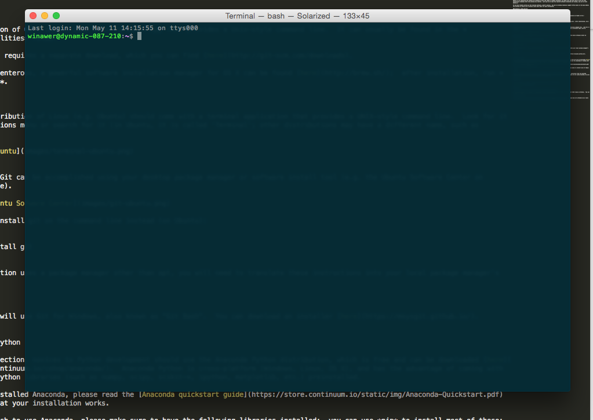
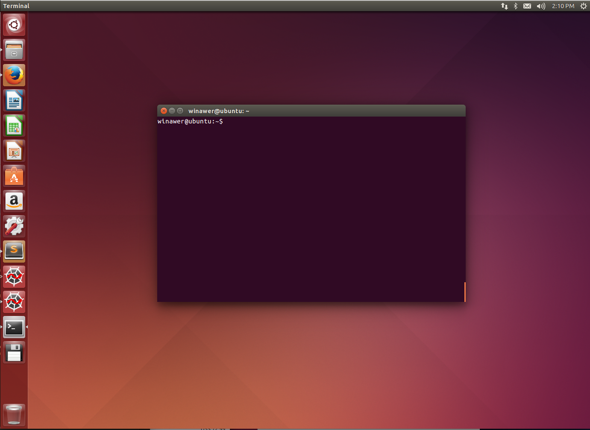
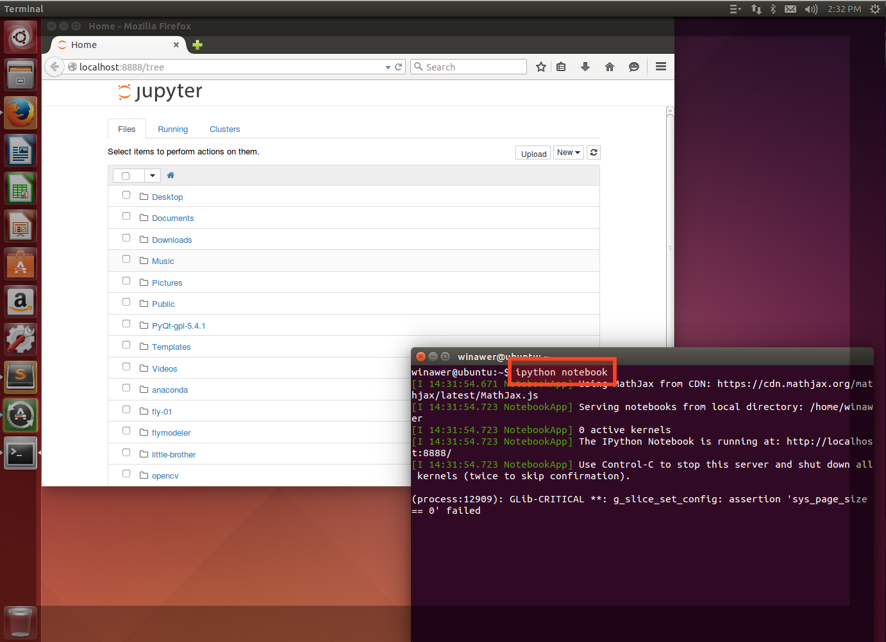

## Installation and requirements

For the workshop you will require a laptop computer that you have administrator access to (i.e. you have the administrator password) in order to install software.

**Important:**  The software for each section must be installed and running properly on your computer *before* the workshop begins.  **We strongly recommend that you attempt to install the software well before the workshop begins.  Do not leave it until the weekend or morning before to try installing and running the software.** With the number of people attending, we simply will not have time to sort out your installation problems after the workshop has started.  **If you do not have the required software installed and running when the workshop begins, you will be left behind.  There will be no exceptions to this rule.**

If you have trouble setting up the required software, **don't panic**.  We will be holding technical support office hours in the days before the workshop to assist you in person; watch your email for more information.

### Section 1: Unix and Git

For this section you will require a working Unix-style command line and git installation.  

#### OS X

Every installation of OS X should come with Terminal.app that provides a Unix-style command line.  It can usually be found in the *Applications/Utilities* folder.  



Git installation requires a separate download, which you can find [here](http://git-scm.com/downloads).  

For the more adventurous, a powerful software installation manager for OS X can be found [here](http://brew.sh/);  after installation, run *brew install git*.

#### Linux

Every major distribution of Linux (e.g. Ubuntu) should come with a terminal application that provides a UNIX-style command line.  Look for it in your applications menu or search for it (in Ubuntu, it is called 'Terminal'; other distributions may have a different name, such as 'Console').




Installation of Git can be accomplished using your desktop package manager or software install tool (e.g. the Ubuntu Software Center on Ubuntu, see image). 


If you wish to install git on the command line instead (on Ubuntu):

```
sudo apt-get install git
```

If your distribution uses a package manager other than apt, you will need to translate these instructions into your local package manager's lingo.

#### Windows

For Windows, we will use Git for Windows, also known as "Git Bash".  You can download an installer [here](https://msysgit.github.io/).

### Section 2: Python

The major choices for installing Python are to use a self-contained distribution or to use a system-installed Python that came with your operating system (unless you are on Windows).  To aid your decision-making, we provide a simple flowchart:


For the Python section, novices to Python development should use the Anaconda Python distribution, which is free and can be downloaded [here](https://store.continuum.io/cshop/anaconda/).  Anaconda Python is cross-platform (Windows, Linux, OS X), and has the advantage of coming with many important Python libraries (such as numpy, scipy, scikit-*, ipython, matplotlib, etc.) preinstalled.  

Once you have installed Anaconda, please read the [Anaconda quickstart guide](https://store.continuum.io/static/img/Anaconda-Quickstart.pdf) and make sure that your installation works.

If you do not wish to use Anaconda, please make sure to have the following libraries installed;  you can use *pip* to install most of these:

* numpy
* ipython

We will also be making significant use of the iPython notebook.  If you installed Anaconda, this should be accessible from the Anaconda Launcher (see the [quickstart guide](https://store.continuum.io/static/img/Anaconda-Quickstart.pdf)).  If you are not using Anaconda or are using Anaconda on Linux, be sure that you can start the notebook interface by going to the command line:

```
ipython notebook
```

If your installation is working, a notebook interface should come up in your browser:



### Section 3: R

If you do not already have R, you can download it [here](http://cran.rstudio.com/). 

For development during the R section of the workshop, we will be using an integrated development environment (IDE) known as RStudio.  You can download an installer [here](http://www.rstudio.com/products/rstudio/download/).

### Section 4: Capstone

If you attend the other three sections, you will already have all the software you require installed.  If you have not attended one or more of the lead-up sections, please refer to their respective installation instructions in this document.
